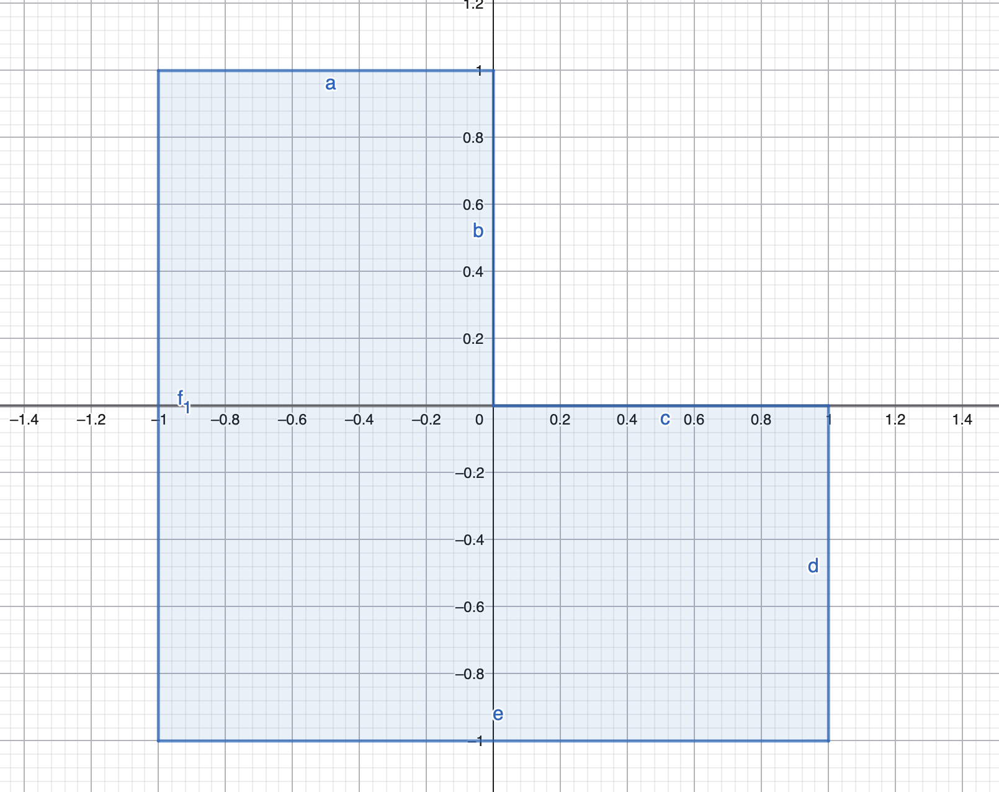
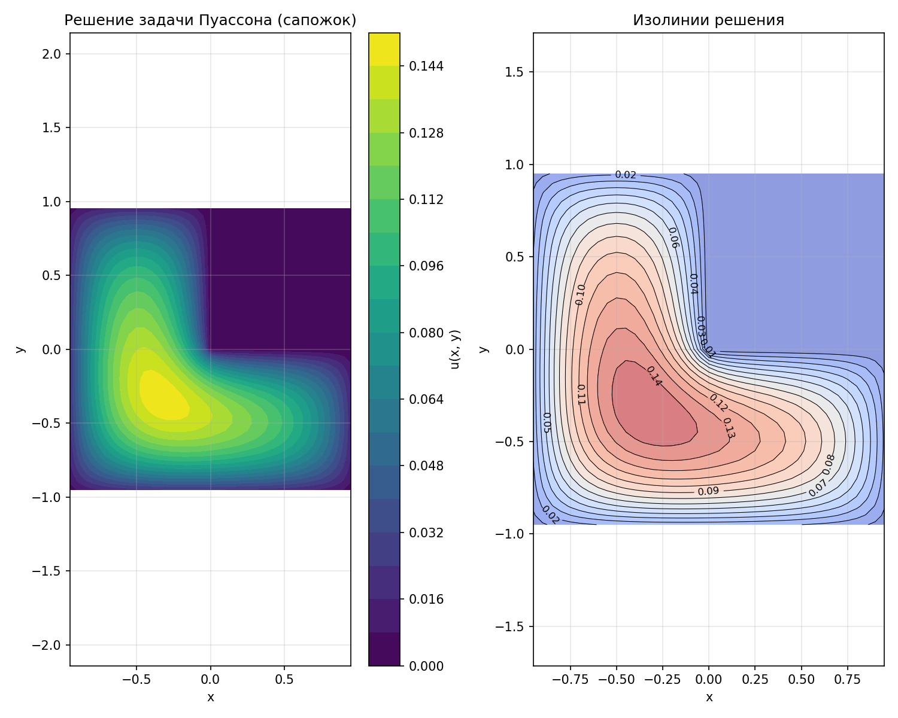
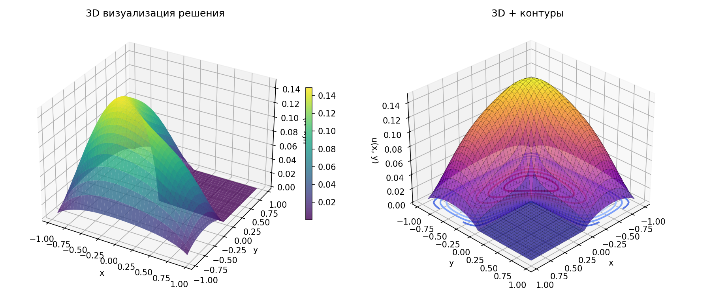
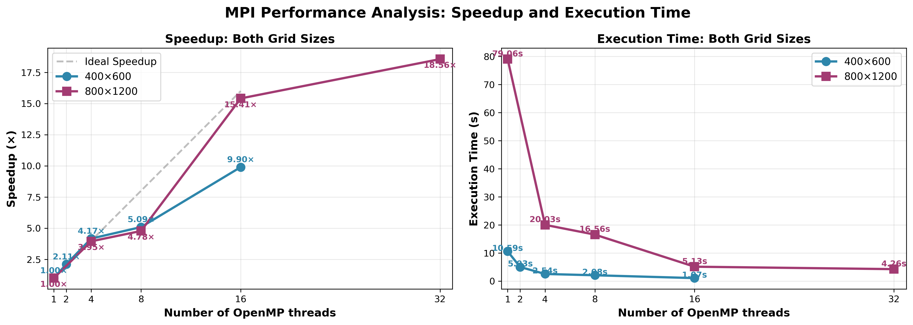
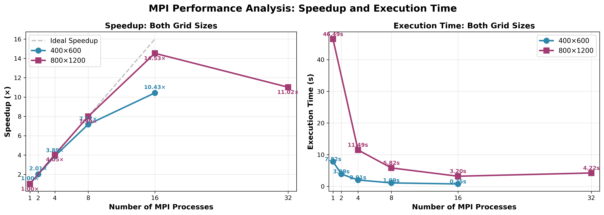
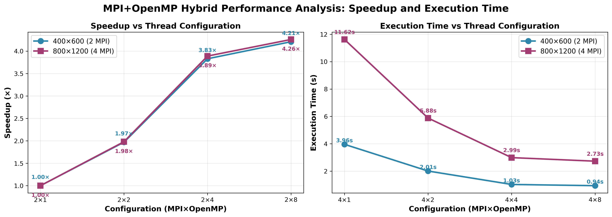
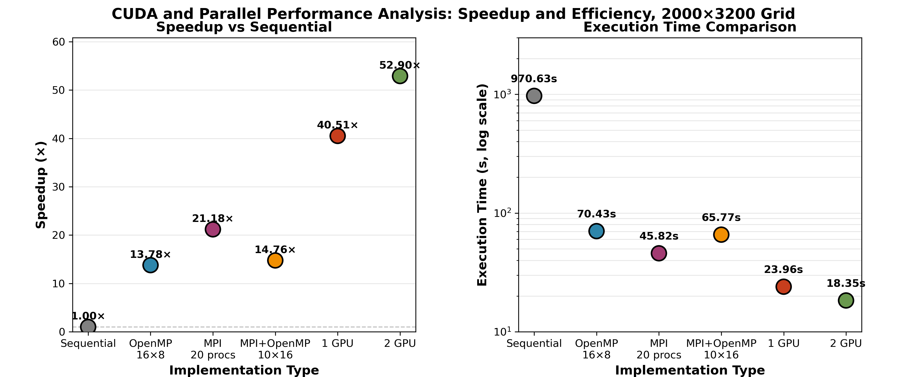

# Отчет по решению задачи Дирихле для уравнения Пуассона

## Вариант 7: Область-сапожок

**Автор:** Пудовиков А.Д.  
**Группа:** 616мс

---

## 1. Постановка задачи

### 1.1 Математическая формулировка

Требуется решить двумерную задачу Дирихле для уравнения Пуассона:

$$ - \Delta u = f(x, y), \quad (x, y) \in D,$$

$$u(x, y) = 0, \quad   (x, y) \in \gamma$$

где:
- **Оператор Лапласа:**  
  $$\Delta u = \frac{\partial^2 u}{\partial x^2} + \frac{\partial^2 u}{\partial y^2}$$

- **Правая часть:**  
  $$f(x, y) = 1 \quad \forall (x, y) \in D$$

- **Область D (сапожок):**  
  $$D = \{(x,y): -1 < x, y < 1\} \setminus \{(x,y): 0 \leq x, y < 1\}$$

  Это квадрат $[-1, 1] \times [-1, 1]$ с вырезанным правым верхним квадрантом $[0, 1] \times [0, 1]$.

- **Граница \gamma:**  
  $$\gamma = \partial D$$

### 1.2 Геометрия области


---

## 2. Метод решения

### 2.1 Метод фиктивных областей

Криволинейная область $D$ заменяется прямоугольником:

$$\Pi = \{(x, y) : -1 < x < 1, -1 < y < 1\}$$

с введением кусочно-постоянного коэффициента:

$$k(x, y) = \begin{cases}
1, & (x, y) \in D \\
1/\varepsilon, & (x, y) \in \hat{D}
\end{cases}$$

где $\hat{D} = \Pi \setminus D$ — фиктивная область, $\varepsilon = h^2$ — параметр метода ($h$ — максимальный шаг сетки).

Решается вспомогательная задача:

$$-\frac{\partial}{\partial x}\left(k(x,y)\frac{\partial v}{\partial x}\right) - \frac{\partial}{\partial y}\left(k(x,y)\frac{\partial v}{\partial y}\right) = F(x, y)$$

$$v(x, y) = 0, \quad (x, y) \in \Gamma$$

где:

$$F(x, y) = \begin{cases}
f(x, y) = 1, & (x, y) \in D \\
0, & (x, y) \in \hat{D}
\end{cases}$$

**Теорема (приближение):**  
$$\max_{(x,y) \in D} |v(x, y) - u(x, y)| < C\varepsilon$$

### 2.2 Разностная схема

На равномерной прямоугольной сетке $\bar{\omega}_h = \bar{\omega}_1 \times \bar{\omega}_2$:

$$\bar{\omega}_1 = \{x_i = -1 + ih_1, \, i = 0, \overline{M}\}, \quad h_1 = \frac{2}{M}$$
$$\bar{\omega}_2 = \{y_j = -1 + jh_2, \, j = 0, \overline{N}\}, \quad h_2 = \frac{2}{N}$$

Дифференциальное уравнение аппроксимируется разностным:

$$-\frac{1}{h_1}\left(a_{i+1,j}\frac{w_{i+1,j} - w_{i,j}}{h_1} - a_{i,j}\frac{w_{i,j} - w_{i-1,j}}{h_1}\right) - \frac{1}{h_2}\left(b_{i,j+1}\frac{w_{i,j+1} - w_{i,j}}{h_2} - b_{i,j}\frac{w_{i,j} - w_{i,j-1}}{h_2}\right) = F_{i,j}$$

для $i = 1, \overline{M-1}$, $j = 1, \overline{N-1}$.

**Коэффициенты:**

$$a_{i,j} = \frac{1}{h_2}\int_{y_{j-1/2}}^{y_{j+1/2}} k(x_{i-1/2}, t) \, dt$$

$$b_{i,j} = \frac{1}{h_1}\int_{x_{i-1/2}}^{x_{i+1/2}} k(t, y_{j-1/2}) \, dt$$

**Правая часть:**

$$F_{i,j} = \frac{1}{h_1 h_2}\iint_{\Pi_{i,j}} F(x, y) \, dx \, dy$$

где $\Pi_{i,j}$ — ячейка сетки вокруг узла $(x_i, y_j)$.

**Граничные условия:**

$$w_{i,j} = 0, \quad (x_i, y_j) \in \Gamma$$

### 2.3 Метод сопряженных градиентов с предобуславливанием

Разностная схема приводится к системе линейных алгебраических уравнений:

$$Aw = B$$

где $A : H \to H$ — самосопряженный положительно определенный оператор.

**Скалярное произведение и норма:**

$$(u, v) = \sum_{i=1}^{M-1}\sum_{j=1}^{N-1} h_1 h_2 \, u_{i,j} v_{i,j}$$

$$\|u\|_E = \sqrt{(u, u)}$$

**Диагональный предобуславливатель:**

$$(Dw)_{i,j} = \left[\frac{a_{i+1,j} + a_{i,j}}{h_1^2} + \frac{b_{i,j+1} + b_{i,j}}{h_2^2}\right] w_{i,j}$$

**Алгоритм:**

1. Начальное приближение: $w^{(0)} = 0$
2. Невязка: $r^{(0)} = B - Aw^{(0)} = B$
3. Решение: $Dz^{(0)} = r^{(0)}$
4. Направление спуска: $p^{(1)} = z^{(0)}$

Для $k = 0, 1, 2, \ldots$ до сходимости:

5. $Ap^{(k+1)}$ — применение оператора
6. $\alpha_{k+1} = \frac{(z^{(k)}, r^{(k)})}{(Ap^{(k+1)}, p^{(k+1)})}$
7. $w^{(k+1)} = w^{(k)} + \alpha_{k+1} p^{(k+1)}$
8. **Проверка сходимости:** если $\|w^{(k+1)} - w^{(k)}\|_E < \delta$, то STOP
9. $r^{(k+1)} = r^{(k)} - \alpha_{k+1} Ap^{(k+1)}$
10. $Dz^{(k+1)} = r^{(k+1)}$
11. $\beta_{k+1} = \frac{(z^{(k+1)}, r^{(k+1)})}{(z^{(k)}, r^{(k)})}$
12. $p^{(k+1)} = z^{(k+1)} + \beta_{k+1} p^{(k)}$

**Контроль монотонности:**

Функционал $H(w^{(k)}) = (B + r^{(k)}, w^{(k)})$ должен монотонно возрастать. При нарушении монотонности — перезапуск метода.

---

## 3. Структура кодовой базы

```
src/
├── poisson_sequential.cpp       # Последовательная версия
├── poisson_omp.cpp              # OpenMP версия
├── poisson_mpi.cpp              # MPI версия
├── poisson_mpi_omp.cpp          # Гибридная MPI+OpenMP версия
├── poisson_solver_mpi.h         # MPI solver c основной логикой, в т.ч. Grid
├── poisson_solver_mpi_omp.h     # MPI + OpenMP solver c основной логикой
├── domain_decomposition.h       # Функции декомпозиции домена для выбора сетки 
├── plot_solution.py             # Визуализация решения
└── plot_speedup.py              # Визуализация производительности
```

---

## 4. Результаты запусков последовательной программы

### 4.1 Численные результаты для последовательного метода

| Сетка $M \times N$ | Узлов | Итераций | Время (с) | $\\|w\\|_E$ | $\\|w\\|_C$ |
|--------------------|-------|----------|-----------|-------------|-------------|
| 10 × 10            | 81    | 21       | 0.000127  | 1.497e-01   | 1.512e-01   |
| 20 × 20            | 361   | 40       | 0.000935  | 1.450e-01   | 1.492e-01   |
| 40 × 40            | 1521  | 73       | 0.006733  | 1.441e-01   | 1.491e-01   |

Где $\| w \|_E$ - евклидова норма решения, $\|w\|_C$ - максимум норма решения. 

Результаты ожидаемые - узмельчение сетки привело к увеличению количества итераций и стабилизации нормы решения.


#### Визуализация решения

**2D визуализация (цветная карта и изолинии):**



**3D визуализация (поверхность с контурами):**



Из визуализации видно:
- Решение положительно во всей области ($f = 1 > 0$)
- Максимум значения $u \approx 0.149$ достигается внутри области
- Значения плавно убывают к границе (граничное условие $u = 0$)
- Решение симметрично относительно диагонали $y = x$

### 4.2 Свойства решения

1. **Положительность:** $u(x, y) > 0$ для всех $(x, y) \in D$ (так как $f = 1 > 0$)
2. **Максимум:** достигается внутри области (принцип максимума для эллиптических уравнений)
3. **Симметрия:** решение примерно симметрично относительно диагонали $y = x$ (из-за геометрии области)
4. **Граничные значения:** $u \to 0$ при приближении к границе


## 5. Результаты запусков OpenMP программы

Основная модификация OpenMP версии от классической последовательной заключалось в использовани директив перед циклами.
Так как в программе в основном использовались двойные циклы для вычисления, приведу пример для них:

```cpp  
#pragma omp parallel for reduction(+:var) schedule(static) collapse(2)
```

Директива ```for```, клауза ```reduction (+:var)``` - для оператора $+$ сохраняем значения в ```var```,
```schedule(static)``` - деление цикла на блоки равной длины, ```collapse(2)``` - сворачивание двойных циклов.

---

### 5.1 Сравнение запусков на сетке 40 × 40 OpenMP 

| Тип Запуска               | Итераций | Время (с) | $\\|w\\|_E$ | $\\|w\\|_C$ |
|---------------------------|----------|-----------|-------------|-------------|
| 40 × 40 последовательный  | 73       | 0.006733  | 1.441e-01   | 1.491e-01   |
| 40 × 40 1 нить            | 73       | 0.0094    | 1.440562e-01   |  1.490863e-01  |
| 40 × 40 4 нити            | 73       | 0.003975  | 1.440562e-01   | 1.490863e-01   |     
| 40 × 40 16 нитей          | 73       | 0.003129  | 1.440562e-01   | 1.490863e-01   |  


Видим, что на такой небольшой решётке время запусков OpenMP решения больше для 1 нити и меньше для бОльшего числа нитей.
Это может быть связано с тем, что был добавлен "лишний" код OpenMP, который нам надо было исполнять, но он не использовался для ускорения программы. 
При этом нормы решения сопоставимые, а значит нет оснований предполагать, что есть ошибка.
На параллельных запусках - наблюдаем тенденцию уменьшения времени работы программы.   


### 5.2 Запуски на больших сетках и графики ускорения

Таблица 1: OpenMP версии

| Кол-во нитей | Число точек сетки (M×N) | Число итераций | Время, с | Ускорение, раз |
|---:|---:|---:|---:|---:|
| 1 | 400×600 | 533 | 10.59| - |
| 2 | 400×600 | 533 | 5.03 | 2.11|
| 4 | 400×600 | 533 | 2.54 | 4.17 |
| 8 | 400×600 | 533 | 2.08 | 5.09 |
| 16 | 400×600 | 533 | 1.07 | 9.90 |
| 1 | 800×1200 | 1048 | 79.06 | - |
| 4 | 800×1200 | 1048 | 20.03 | 3.95 |
| 8 | 800×1200 | 1048 | 16.56 | 4.78 |
| 16 | 800×1200 | 1048 | 5.13 | 15.41 |
| 32 | 800×1200 | 1048 | 4.26 | 18.56 |

#### Графики ускорения и времени выполнения




Из графиков видно:
- **Ускорение** растет с увеличением числа нитей, достигая 18.56× на 32 нитях для сетки 800×1200
- Для сетки 800×1200 эффективность выше благодаря большему объему вычислений

---

## 6. Результаты запусков MPI программы

Для создания MPI версии программы было необходимо разработать алгоритм двумерного разбиения исходного прямоугольника, так чтобы:

1. Отношение количества узлов по переменым $x$ и $y$ в каждом домене принадлежало
диапазону [1/2,2]. 
Это требование выполняется с помощью выбора "самого квадратного" разбиения (у которого отношение сторон ближе всего к 1).
Перебор происходит только по тем разбиениям, которые удовлетворяют заявленному условию.

2. Количество узлов по переменым $x$ и $y$ любых двух доменов отличалось не более, чем
на единицу. Это требование автоматически выполняется при использовании блочного распределения узлов. 
Если всего $N_x$ внутренних узлов по $x$ распределяются на $P_x$ процессов, то каждый процесс получает либо $\lfloor N_x / P_x \rfloor$, либо $\lceil N_x / P_x \rceil$ узлов, то есть разница в один узел.

Далее надо было реализовать обмен граничными значениями  на решётке для процессов, для этого используется функция excahnge() с MPI_Sendrecv().
Для нахождения соседей по решётки использовал MPI_Cart_shift().
Для проверки условий остановки и вычисления норм используются операции MPI_Allreduce(), чтобы учесть значения со всех доменов.


### 6.1 Сравнение запусков на сетке 40 × 40 MPI 

| Тип Запуска               | Итераций | Время (с) | $\\|w\\|_E$ | $\\|w\\|_C$ |
|---------------------------|----------|-----------|-------------|-------------|
| 40 × 40 последовательный  | 73       | 0.006733  | 1.441e-01   | 1.491e-01   |
| 40 × 40 1 процесс         | 80       | 0.005571  | 1.327e-01   | 1.412e-01   |
| 40 × 40 2 процесса        | 80       | 0.005007  | 1.327e-01   | 1.412e-01   |     
| 40 × 40 4 процесса        | 80       | 0.003197  | 1.327e-01   | 1.412e-01   |  

Как и в случае OpenMP не получается наблюдать ускорение для использования MPI программы, так как накладные расходы значительно выше, чем потенциальный выигрыш.
Для версий MPI наблюдаем уменьшение времени работы, что говорит об эффективности нашего решения.
При этом нормы решения сопоставимые, а значит нет оснований предполагать, что есть ошибка.


### 6.2 Запуски на больших сетках и графики ускорения

Таблица 2: MPI версии

| Кол-во процессов MPI | Число точек сетки (M×N) | Число итераций | Время, с | Ускорение, раз |
|---:|---:|---:|---:|---:|
| 1 | 400×600 | 730 | 7.82 | - |
| 2 | 400×600 | 730 | 3.89 | 2.01 |
| 4 | 400×600 | 730 | 2.01 | 3.89 |
| 8 | 400×600 | 730 | 1.09 | 7.17 |
| 16 | 400×600 | 730 | 0.75 | 10.43 |
| 1 | 800×1200 | 1048 | 46.49 | - |
| 4 | 800×1200 | 1048 | 11.49 | 4.05 |
| 8 | 800×1200 | 1048 | 5.82 | 7.99 |
| 16 | 800×1200 | 1048 | 3.20 | 14.53 |
| 32 | 800×1200 | 1048 | 4.22 | 11.02 |

#### Графики ускорения и времени выполнения




Из графиков видно:
- **Ускорение** растет с увеличением числа процессов, достигая 14.53 раз на 16 процессах для сетки 800×1200
- Видно, что для сетки 800×1200 ускорение не монотонно на 32 процессах, это может быть связано с накладными расходами, которые возникают на бОльшем количестве процессов.
- Для сетки 800×1200 эффективность выше благодаря большему объему вычислений
- Ускорение во всех случаях оказывается меньше линейного 

---

## 7. Результаты запусков MPI+OpenMP программы.

Основная задача - разработать гибридный алгоритм программы для запусков совмещённой версии MPI и OpenMP. 
Для этого в MPI код были добавлены OpenMP директивы по аналогии с чисто OpenMP версией.

### 7.1 Сравнение запусков на сетке 40 × 40 MPI 

| Тип Запуска                    | Итераций | Время (с) | $\\|w\\|_E$ | $\\|w\\|_C$ |
|--------------------------------|----------|-----------|-------------|-------------|
| 40 × 40 последовательный       | 73       | 0.006733  | 1.441e-01   | 1.491e-01   |
| 40 × 40 1 MPI процесс + 4 нити | 80       | 0.003406  | 1.327e-01   | 1.412e-01   |
| 40 × 40 2 MPI процесс + 4 нити | 80       | 0.003304  | 1.327e-01   | 1.412e-01   |

Ожидаемо, что нормы решения совпали с MPI версией и последовательной. 
По времени испольнения программы наблюдаем ускорение, использовалась привзяка нитей к ядрам.

### 7.2 Запуски на больших сетках и графики ускорения

Таблица 3: MPI + OpenMP версия

| Кол-во процессов MPI | Кол-во нитей OpenMp | Число точек сетки (M×N) | Число итераций | Время, с | Ускорение, раз |
|---:|---:|---:|---:|---:|---:|
| 2  | 1 | 400×600 | 730 | 3.96 | - |
| 2  | 2 | 400×600 | 730 | 2.01 | 1.97 |
| 2  | 4 | 400×600 | 730 | 1.03 | 3.83 |
| 2  | 8 | 400×600 | 730 | 0.94 | 4.21 |
| 4  | 1 | 800×1200 | 1065 | 11.62 | - |
| 4  | 2 | 800×1200 | 1065 | 5.88 | 1.98 |
| 4  | 4 | 800×1200 | 1065 | 2.99 | 3.89 |
| 4  | 8 | 800×1200 | 1065 | 2.73 | 4.26 |



Из графиков видно:
- **Ускорение** растет с увеличением числа процессов, достигая 4.26 раз на 4 MPI 8 OpenMP для сетки 800×1200
- Видно, что для обеих сеток ускорение монотонно
- Для сетки 800×1200 эффективность незначительно выше благодаря большему объему вычислений
- Ускорение во всех случаях оказывается меньше линейного по числу нитей

## 7. Результаты запусков MPI+CUDA программы.

Этап разработки проходил в два этапа - вначале было реализовано базовое решение, а потом оно было доработано с учётом медленной скорости.

Основная сложность заключалась в организации редукции (а именно вычисления скалярных ), так как по условию задачи нам запрещено использовать разделяемую память,
то вначале я остановился на схеме с редукцией данных с копированием их всех на CPU.
Такое решение было относительно простым и понятным, но оно привело к тому, что работа с CPU занимала бОльшую часть времени, а вычисления на GPU составляли мене 5% общей работы программы.

После этого я использовал оптимизацию - подсчёт частичных сумм сразу же на GPU, а также P2P взаимодействие. 

Технические вопросы:
- Расширил поддержку Makefile для CUDA, использовать с компилятором HOST_COMP=mpicxx.
- В результате перебора на 160 потоков для гибридной версии MPI + OpenMP выбор пал на комбинацию 10 MPI × 16 threads. 
- Так как нельзя пользоваться shared memory, то пользовался глобальной памятью, редукцией на CPU и P2P обменом для GPU.
- В решение использовал самый простой вариант - с блокирующими операциями (```MPI_Sendrecv(), cudaMemcpy()```)

<!-- 2 GPU: Iterations: 2641
Total time: 18.731347 s
||w||_E = 1.438477e-01, ||w||_C = 1.494813e-01

=== Detailed timings ===
GPU initialization:  1.038036 s
apply_A kernels:     0.699180 s
apply_D_inv kernels: 0.339733 s
Vector ops kernels:  0.406680 s
GPU->CPU copies:     12.330235 s
CPU->GPU copies:     0.126194 s
MPI exchange:        0.514256 s
MPI allreduce:       3.684334 s
CPU reductions:      0.000000 s
1 GPU: Iterations: 2641
Total time: 23.390093 s
||w||_E = 1.438477e-01, ||w||_C = 1.494813e-01

=== Detailed timings ===
GPU initialization:  1.986904 s
apply_A kernels:     1.353402 s
apply_D_inv kernels: 0.765263 s
Vector ops kernels:  0.812786 s
GPU->CPU copies:     12.868332 s
CPU->GPU copies:     0.182320 s
MPI exchange:        1.089756 s
MPI allreduce:       5.325507 s
CPU reductions:      0.000000 s


OpenMP:
=== Timing Breakdown ===
Coefficients init:    0.087129 s
apply_A:              45.199635 s
apply_D_inv:          9.909228 s
Vector operations:    8.620510 s
Local reductions:     6.635815 s
---
Total time (solve):   119.371748 s

Saved: results/solution_2000x3200.txt

End time: Sun Nov 30 00:02:48 MSK 2025
=== Job completed ===

MPI:
MPI grid: 4 x 5 (procs=20)
Global grid: 2000 x 3200
Iterations: 2641
Time: 45.816858 s
||w||_E = 1.438477e-01, ||w||_C = 1.494813e-01

=== Timing Breakdown ===
Coefficients init:    0.044712 s
apply_A:              23.247202 s
apply_D_inv:          3.482127 s
Vector operations:    9.896023 s
MPI exchange:         0.127331 s
MPI allreduce:        4.398595 s
Local reductions:     4.654696 s
---
Total time (solve):   45.816858 s

>>> Тест 7/7: 10 MPI процессов × 16 OpenMP нитей, сетка 2000×3200

10              16              2000×3200      2641         47.310990       .08         
  ||w||_E = 1.438477e-01, ||w||_C = 1.438477e-01, ||w||_C 
 -->

## 7.1 Сравнение работы программы на большой сетке.

Для того, что увидеть ускорение в программе с GPU была использована увеличенная до 2000 × 3200 сетка. 

<!-- 
| Тип Запуска               | Итераций | Время (с) | $\\|w\\|_E$ | $\\|w\\|_C$ |
|---------------------------|----------|-----------|-------------|-------------|
| 2000 × 3200, последовательный  | --       | > 1800  | 1.441e-01   | 1.491e-01   |
| 2000 × 3200, OpenMp         | 2618       | 70.43  | 1.327e-01   | 1.412e-01   |
| 2000 × 3200, 20 MPI         | 2641       | 45.816858  | 1.438e-01, | 1.438e-01  |
| 2000 × 3200, 10 MPI × 16 threads  | 2641       | 47.310990  | 1.438e-01   | 1.412e-01   |     
| 2000 × 3200, 1 GPU        | 2641       | 89.415588  | 1.438e-01 | 1.495e-01   |   
| 2000 × 3200, 2 GPU        | 2641       | 34.602038   | 1.438e-01 | 1.495e-01   |  


-->


| Тип Запуска | Итераций | Время общее (с) | $\|w\|_E$ | $\|w\|_C$ | GPU инициализация | apply_A | apply_D_inv | Обновление векторов | GPU->CPU копирования | CPU->GPU копирования | MPI обмен | MPI allreduce | CPU редукции | Коэфф. инициализация | OpenMP редукция |
|-------------|----------|-----------|------------|------------|-------------------|--------------|------------------|-------------------|---------------------|---------------------|-----------|---------------|-------------|---------------------|-------------------|
| 2000 × 3200, последовательный | -- | > 1800 | - | - | - | - | - | - | - | - | - | - | - | - | - |
| 2000 × 3200, 16 × 8 threads OpenMP | 2618 | 70.43 | 1.327e-01 | 1.412e-01 | - | 45.199635 | 9.909228 | 8.620510 | - | - | - | - | - | 0.087129 | 6.635815 |
| 2000 × 3200, 20 MPI | 2641 | 45.816858 | 1.438e-01 | 1.438e-01 | - | 23.247202 | 3.482127 | 9.896023 | - | - | 0.127331 | 4.398595 | 4.654696 | 0.044712 | - |
| 2000 × 3200, 10 MPI × 16 threads | 2641 | 47.310990 | 1.438e-01 | 1.412e-01 | - | - | - | - | - | - | - | - | - | - | MPI |
| 2000 × 3200, 1 GPU | 2641 | 23.390093 | 1.438e-01 | 1.495e-01 | 1.986904 | 1.353402 | 0.765263 | 0.812786 | 12.868332 | 0.182320 | 1.089756 | 5.325507 | 0.000000 | - | - |
| 2000 × 3200, 2 GPU | 2641 | 18.731347 | 1.438e-01 | 1.495e-01 | 1.038036 | 0.699180 | 0.339733 | 0.406680 | 12.330235 | 0.126194 | 0.514256 | 3.684334 | 0.000000 | - | - |


Так как нормы решений совпадают и алгоритмы сходятся, то есть все основания считать, что предложенные реализации алгоритмов работают.



Запуск на 2ух GPU оказался лучше, чем на 1ом.

Сетка для решения уже достаточно большая (последовательная версия не посчиталась за 30 минут на Polus).

При этом видим, что ускорение GPU операций менее 2ух раз при увеличении количества GPU в 2 раза.

Это может быть связано с дополнительными расходами на обмены между ГПУ, а так же не стабильной операцией копирования.  

Время на копировании GPU --> CPU и обратно довольно большое, но текущая версия решение позволяет значительно опередить остальные версии.

---

## 8. Выводы.

В рамках предоставленного задания мне удалось численно решить двумерную задачу Дирихле для уравнения Пуассона на языке C++.
Для ускорения вычислений на мелких сетках я использовал ускорение через 
 - OpenMP нити,
 - MPI процессы,
 - MPI процессы и OpenMP нити
 - MPI процесса и поддержка CUDA

Все перечисленные методы показали необходимость в их использовании для решения больших задач.
Для запуска решений использовался удалённый сервер Polus с планировщиком IBM Spectrum LSF.
